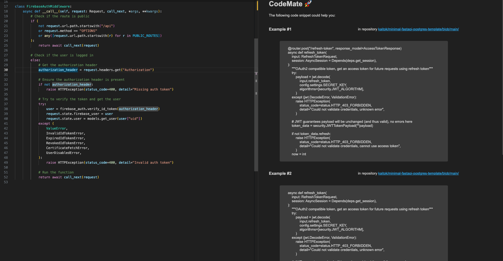
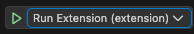

# CodeMate 🚀

CodeMate is a VSCode extension that helps you find helpful examples while you code using AI

<p align="center">
     
</p>

## Setup

First, you need to start the Python backend and then the TypeScript VSCode extension.

### Prerequisites

To run this app locally, you need

-   Python 3.11 or above
-   An OpenAI API key (get it here [here](https://platform.openai.com/api-keys) or reach out to me if you're testing)
-   VSCode installed locally

### Python Backend

Create virtualenv and install requirements

```
cd backend
python3 -m venv .venv
source .venv/bin/activate
pip install -r requirements.txt
```

### Extension (Frontend)

Install dependencies

```
cd extension
npm install
npm compile
```

## Ingest Data 

This repository also includes the relevant downloaded code and embeddings as downloading the code runs for multiple hours. Anyhow, in the following the process for retrieving them is outlined. 

All code in this section runs within the backend folder, i.e. run 

```
cd backend
```

### Download Github Repositories

Get an access token for the Github API as explained [here](https://docs.github.com/en/authentication/keeping-your-account-and-data-secure/managing-your-personal-access-tokens#creating-a-fine-grained-personal-access-token). Then, set your Github API key via 

``` 
export GITHUB_API_KEY="YOUR_API_KEY"
```

Open the notebook [load_repos](backend/codemate/scripts/load_repos.ipynb) and run all cells. This will download the top repos for FastAPI and store them within the project under `backend/data/raw`. 

To filter any unrelated files and format the code files, run 

```
sh ./copy_python_files.sh
```

Create a mapping from repo names to their URLs (done in hindsight to enable repo links in the URL)

```
python3 -m codemate.scripts.store_repo_urls
```

Finally, you can finde the downloaded code files under `backend/data/processed`. 

### Chunk the code and create text representations

The existing code needs to be chunked using 

``` 
python3 -m codemate.scripts.create_chunks
```

To also convert the code to text explanations (which we can embedd), run the following code. This requires a GPU with 32GB VRAM and takes 8 hours or more. 

``` 
python3 -m codemate.scripts.create_chunks --add_text_description
```

### Create the vectorstores

To create the unixcoder embeddings which are required to run the extension, run the following script. You can replace unixcoder with any other embedding to create this one specifically. 

``` 
python3 -m codemate.scripts.create_embeddings --embedding_name=unixcoder --drop
```

To create all embeddings that are used during development of the app, run 

```
cd backend
sh ./create_embeddings.sh
```

The embeddings will be stored in `backend/embeddings`

### Visualize the embeddings

Visualize the embeddings using Nomic Atlas. Make sure to login to their service as outlined [here](https://docs.nomic.ai/atlas/introduction/quick-start) and set the `NOMIC_TOKEN` environment variable accordingly. 

```
python3 -m codemate.scripts.nomic_atlas_upload
```

## Start the app 

### Python Backend 

Start the backend

```
export OPENAI_API_KEY="YOUR_API_KEY"
python3 -m codemate.api.main
```

### Extension (Frontend)

Open the extension's code in VSCode

```
cd extension
code .
```

And launch the application by pressing `F5` or by using the run button (config "Run Extension") 

## Test embeddings

A fundamental part of the project was testing the embeddings. To reproduce these results, you can run 

```
cd backend 
python3 -m codemate.scripts.evaluate_embeddings --embedding_names=unixcoder
```

where the embedding name can be any of the possible embedding names that we created embeddings for. 

The test queries are stored in `backend/data/test_data`. 

The script will store an HTML file containing the different code chunks that were retrieved for each test query in `backend/out`. It will also store an Excel file that can be used to manually evaluate the results in randomized order and anonymized. 
